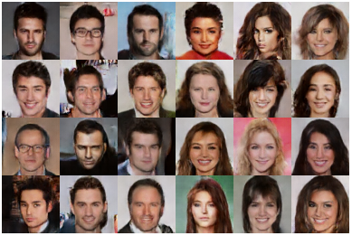
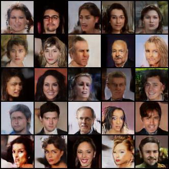
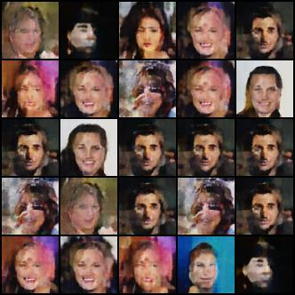

# Generating Images Using Generative Deep Learning - How batch and window sizes affect image quality in Swin Transformer GANs

This is my university undergraduate dissertation on the use of Swin Transformer GANs and how batch size and window size affects generated image quality.

The project was undertaken on the Viking Cluster, which is a high performance compute facility provided by the University of York. I am grateful for the computational support from the University of York High Performance Computing service, Viking and the Research Computing team.

## Abstract

## Sample Results

### Hand-picked generated images from a set of 5000 images
Each image in this set was visually inspected by me to compile a set of what I believe to be the best examples.

### Best set (window size 8, batch size 100)
Unlike the hand-picked set, this set used random initial vectors for each image.

### Worst set (window size 8, batch size 200)
This set also used random initial vectors for each image. However, the quality on this set is the worst out of any experiment I recorded in the project. Note the repeated faces and general lack of feature definition.

